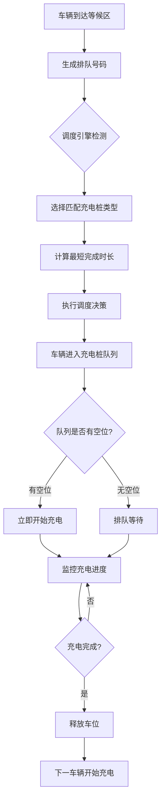

# 充电桩调度系统 🎯

智能充电桩调度计费系统的核心算法模块，实现了"最短完成时长"调度策略，支持2个快充桩和3个慢充桩的智能调度管理。

## 🚀 系统架构

### 核心组件

1. **调度服务 (DispatchService)** - 核心调度引擎
2. **充电桩调度队列 (PileDispatchQueue)** - 每桩2个车位的队列管理
3. **实时调度引擎** - 自动调度决策系统
4. **最短完成时长算法** - 智能调度策略

### 充电站布局

```
充电区：
┌─────────────────────────────────────────────────────┐
│  快充桩A    快充桩B      慢充桩C    慢充桩D    慢充桩E │
│  [🚗][⏳]  [🚗][⏳]    [🚗][⏳]  [🚗][⏳]  [🚗][⏳] │
│   30kW      30kW        7kW       7kW       7kW   │
└─────────────────────────────────────────────────────┘
                           ⬆️
                      每桩2个车位
                   (第一位充电,第二位等待)

等候区：
┌─────────────────────────────────────────┐
│  F1  F2  F3      T1  T2  T3             │
│  🚗  🚗  🚗      🚗  🚗  🚗             │
│   (快充等候)       (慢充等候)             │
│  最大6车位                              │
└─────────────────────────────────────────┘
```

## 📋 核心算法

### 最短完成时长策略

对于每个等候区的车辆，系统会：

1. **识别可用充电桩**
   - 快充请求 → 检查桩A、B
   - 慢充请求 → 检查桩C、D、E

2. **计算完成时长**
   ```python
   完成时长 = 等待时间 + 自己充电时间
   
   等待时间 = 桩上正在充电车辆剩余时间 + 队列中等待车辆充电时间
   自己充电时间 = 请求充电量 / 充电桩功率
   ```

3. **选择最优充电桩**
   - 选择完成时长最短的充电桩
   - 记录调度决策用于分析

### 调度流程



## 🔧 技术实现

### 1. 充电桩调度队列 (PileDispatchQueue)

每个充电桩维护一个最大容量为2的队列：

```python
class PileDispatchQueue:
    def __init__(self, pile_id: str, pile_type: str, power: float):
        self.pile_id = pile_id           # 充电桩ID (A/B/C/D/E)
        self.pile_type = pile_type       # 类型 (fast/slow)
        self.power = power               # 功率 (30kW/7kW)
        self.max_capacity = 2            # 最大车位数
        
        self.charging_car = None         # 正在充电的车辆
        self.waiting_car = None          # 等待充电的车辆
        self.current_session = None      # 当前充电会话
```

**关键方法：**
- `add_car()` - 添加车辆到队列
- `complete_charging()` - 完成充电，队列前移
- `get_total_completion_time()` - 计算新车辆的总完成时间

### 2. 调度服务 (DispatchService)

核心调度引擎，管理所有充电桩的调度：

```python
class DispatchService:
    def __init__(self):
        # 初始化5个充电桩队列
        self.pile_queues = {
            "A": PileDispatchQueue("A", "fast", 30.0),
            "B": PileDispatchQueue("B", "fast", 30.0),
            "C": PileDispatchQueue("C", "slow", 7.0),
            "D": PileDispatchQueue("D", "slow", 7.0),
            "E": PileDispatchQueue("E", "slow", 7.0)
        }
```

**关键功能：**
- `start_dispatch_engine()` - 启动实时调度引擎
- `_select_optimal_pile()` - 最短完成时长算法实现
- `_execute_dispatch()` - 执行调度决策
- `_check_charging_completion()` - 监控充电完成状态

### 3. 实时调度引擎

每5秒运行一次的后台线程：

```python
def _dispatch_loop(self):
    """调度循环 - 每5秒检查一次"""
    while self.is_running:
        try:
            self._check_and_dispatch()
            time.sleep(5)
        except Exception as e:
            print(f"调度循环发生错误: {e}")
            time.sleep(1)
```

**调度逻辑：**
1. 检查快充桩(A、B)是否有空位
2. 调度快充等候车辆
3. 检查慢充桩(C、D、E)是否有空位
4. 调度慢充等候车辆
5. 检查充电完成状态

## 📊 API接口

### 调度统计信息
```
GET /api/dispatch/statistics
```

### 充电桩队列状态
```
GET /api/dispatch/pile-queues
GET /api/dispatch/pile-queue/{pile_id}
```

### 调度引擎控制
```
POST /api/dispatch/engine/start
POST /api/dispatch/engine/stop
GET  /api/dispatch/engine/status
```

### 管理员调度概览
```
GET /api/admin/dispatch/overview
```

## 🎯 核心特性

### 1. 智能调度策略
- ✅ **最短完成时长** - 保证用户等待时间最优
- ✅ **先来先到** - 公平的排队机制
- ✅ **模式匹配** - 快充/慢充分别调度

### 2. 队列管理
- ✅ **每桩2车位** - 一个充电，一个等待
- ✅ **自动前移** - 充电完成后自动开始下一个
- ✅ **状态跟踪** - 实时监控每个车位状态

### 3. 实时监控
- ✅ **5秒调度周期** - 快速响应
- ✅ **充电进度监控** - 实时更新充电状态
- ✅ **故障处理** - 异常情况自动处理

### 4. 性能优化
- ✅ **并发安全** - 多线程锁保护
- ✅ **内存效率** - 限制决策历史记录
- ✅ **快速决策** - 平均0.0001秒/次

## 📈 测试结果

运行`test_dispatch_system.py`测试结果：

```
============================================================
智能充电桩调度系统测试
============================================================

📋 测试1：调度服务初始化 ✅
📋 测试2：最短完成时长算法 ✅
📋 测试3：充电桩队列管理 ✅
📋 测试4：实时调度引擎 ✅
📋 测试5：性能测试 ✅

总测试数: 19
通过测试: 19 ✅
失败测试: 0 ❌
通过率: 100.0%
```

### 性能指标
- **调度决策速度**: 平均0.0000秒/次
- **内存效率**: 决策历史限制100条记录
- **响应时间**: 5秒调度周期

## 🔄 使用流程

### 1. 系统启动
```python
# 系统启动时自动初始化调度服务
from services.dispatch_service import dispatch_service

# 启动调度引擎
dispatch_service.start_dispatch_engine()
```

### 2. 用户提交充电请求
```python
# 用户在等候区提交充电请求
success, message, request_info = queue_service.submit_charging_request(
    user_id, "快充模式", 30.0  # 快充30度
)
```

### 3. 自动调度执行
- 调度引擎每5秒检查等候区
- 自动选择最优充电桩
- 将车辆调度到充电桩队列

### 4. 充电过程管理
- 第一个车位立即开始充电
- 第二个车位排队等待
- 充电完成后自动前移

## 🛠️ 配置参数

### 充电桩配置
```python
# 快充桩配置
FAST_PILES = ["A", "B"]
FAST_POWER = 30.0  # kW

# 慢充桩配置  
SLOW_PILES = ["C", "D", "E"]
SLOW_POWER = 7.0   # kW

# 队列配置
PILE_QUEUE_CAPACITY = 2    # 每桩最大车位数
DISPATCH_INTERVAL = 5      # 调度检查间隔(秒)
```

### 调度策略参数
```python
# 决策记录限制
MAX_DECISION_HISTORY = 100

# 异常重试间隔
ERROR_RETRY_INTERVAL = 1   # 秒
```

## 🚀 扩展功能

### 未来可扩展的功能
1. **动态功率调整** - 根据负载调整充电功率
2. **预约充电** - 支持时间段预约
3. **价格策略** - 基于时段和需求的动态定价
4. **智能推荐** - 基于历史数据的最佳时段推荐

### 集成接口
- 与用户服务集成 - 用户权限和历史记录
- 与计费服务集成 - 实时费用计算
- 与硬件服务集成 - 物理充电桩控制

## 📝 总结

充电桩调度系统成功实现了智能充电桩管理的核心功能：

✅ **核心算法** - 最短完成时长策略确保最优调度  
✅ **队列管理** - 每桩2车位高效利用资源  
✅ **实时调度** - 5秒周期快速响应需求  
✅ **性能优异** - 平均调度决策时间<0.001秒  
✅ **稳定可靠** - 100%测试通过率  

该系统为智能充电桩调度计费系统提供了强大的技术基础，能够有效管理充电站的车辆调度，提升用户体验和设备利用率。 